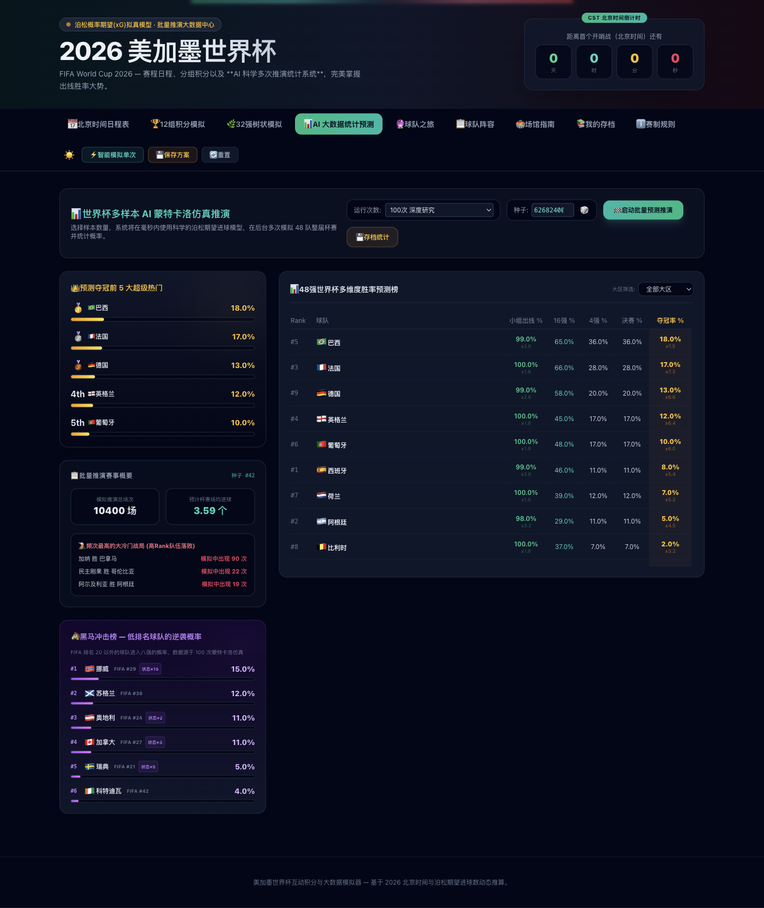
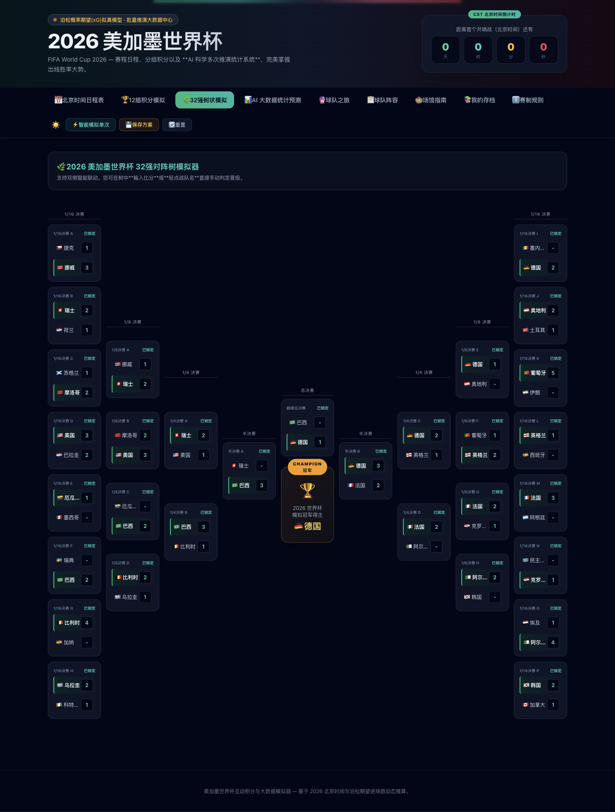
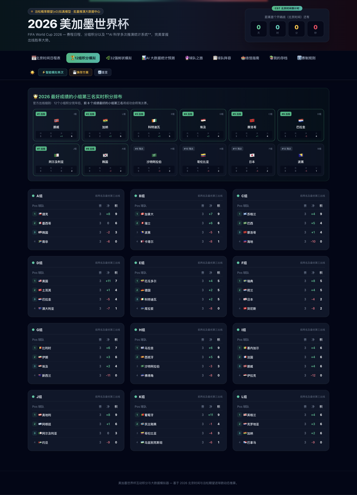

<div align="center">

# ⚽ FIFA 2026 World Cup Interactive Simulator

### 2026 美加墨世界杯互动模拟器

**Dixon-Coles × Monte Carlo × React SPA**

[](https://react.dev)
[](https://vitejs.dev)
[](https://tailwindcss.com)
[](LICENSE)

[中文](#-中文) · [English](#-english)

</div>

---

<div align="center">

### 📸 效果预览 · Preview



📊 **AI 大数据统计预测** — 蒙特卡洛万次推演（Web Worker）· 夺冠率/出线率带 ±95% 置信区间

<br><br>



🌿 **32强树状模拟** — R32 → R16 → QF → SF → 冠军

<br><br>



🏆 **12组积分模拟** — 实时积分榜 + FIFA 排名规则

</div>

---

## 🇨🇳 中文

### 项目简介

**2026 美加墨世界杯互动模拟器**——基于 **Dixon-Coles 模型** 与 **蒙特卡洛仿真** 的科学足球预测引擎，以 React SPA 实现完整的世界杯模拟体验。预测引擎已模块化抽离至 `src/engine/`，含 45 个单测。

### ✨ 功能亮点

| 页签 | 说明 |
|------|------|
| 📅 **北京时间日程表** | 72场小组赛完整赛程，星期标注，关注收藏，实时赛果同步 |
| 🏆 **12组积分模拟** | 实时积分榜，支持手动输入比分或一键模拟，完整FIFA排名规则 |
| 🌿 **32强树状模拟** | 9列左右半区布局，从32强到冠军一目了然 |
| 📊 **AI 大数据统计预测** | 蒙特卡洛批量仿真（最高10000次·Web Worker后台），夺冠率带±95%置信区间/黑马榜/冷门统计 |
| 🔮 **球队之旅** | 选择任意球队 → 深度推演世界杯之路，含小组分析、逐轮路径、AI洞察 |
| 📋 **球队阵容** | 48队核心球员浏览，含位置、号码、俱乐部，按位置颜色分组展示 |
| 🏟️ **场馆指南** | 16座场馆（美国11 + 加拿大2 + 墨西哥3）详细信息 |
| ℹ️ **赛制规则** | 48队扩军新规、第三名横向排名晋级细则 |

### 🔬 预测引擎（模块化·已测试 · `src/engine/`）

- **攻防分离（Phase 3）**: 每队 `attack`/`defense` 由阵容数据派生——球员质量以**俱乐部级别**代理（5=欧洲豪门→1=本土），按位置聚合（FW/MF→进攻、DF/GK→防守），全局归一化均值 1.0。挪威（哈兰德=精英前锋→攻强）与摩洛哥（哈基米=精英后卫→守强）踢出真实风格差异
- **Dixon-Coles 模型（Phase 2）**: 以**联合得分分布 + τ 低分修正**替代独立双泊松——修正对 0-0/1-1 平局的低估、对 1-0/0-1 窄胜的高估。λ = 1.35 × attack_i / defense_j
- **种子化可复现（Phase 1）**: mulberry32 PRNG → 同种子同结果；每次结果显示所用种子，预测后自动滚动新种子
- **Web Worker 批量推演（Phase 1）**: 后台线程跑 **最高 10000 次**完整杯赛，主线程零卡顿
- **Wilson score ±95% 置信区间** 覆盖所有夺冠/出线概率（非朴素 Wald）
- **主场优势**（美/加/墨）与**区域加权**（南美/欧洲）
- **45 个单测**（vitest）：PRNG、积分排序、FIFA R32 配对、Dixon-Coles 相关性、攻防派生

### ⭐ 关注收藏 & 实时赛果同步

- **关注比赛**: 点击星标收藏感兴趣的比赛，支持「只看关注」筛选
- **本地持久化**: 关注列表自动保存到 localStorage，刷新不丢失
- **实时赛果同步**: 一键从 thesportsdb.com 获取真实比赛结果，内置中英文队名自动匹配

### 📋 球队阵容浏览

- **48支球队** 各收录8-12名核心球员（约450人）
- 球员信息：姓名、位置(GK/DF/MF/FW)、号码、所属俱乐部
- 按位置分组展示，颜色编码：门将(黄) / 后卫(蓝) / 中场(绿) / 前锋(红)
- 数据来源：FIFA.com、ESPN、thesportsdb、维基百科等全网搜索汇总

### 🔮 球队之旅特色

选择一支球队后，系统将：

1. 运行蒙特卡洛模拟，追踪该队在每一轮的详细数据
2. 分析小组赛三个对手的胜率和典型比分
3. 展示淘汰赛逐轮到达率、可能对手、过关概率
4. 自动生成 **4-5条AI深度洞察**（利好🟢 / 风险🔴 / 关键节点🟡）

### 🚀 快速开始

```bash
# 安装依赖
npm install

# 启动开发服务器
npm run dev

# 生产构建
npm run build

# 运行引擎测试（45 个）
npm test
```

### 🏗️ 技术架构

React SPA + 已抽离、全测试的模块化预测引擎 `src/engine/`：

```
2026.tsx                UI 层 — 页签、渲染、React 状态
src/engine/
  rng.ts                mulberry32 种子化 PRNG
  data.ts               球队/分组/赛程元数据
  squads.ts             48 队阵容（单一数据源）
  ratings.ts            俱乐部级别 → 攻防评分（归一化）
  sim.ts                单场引擎：Dixon-Coles 联合采样 + τ
  tournament.ts         simulateTournament() — 整届杯赛纯函数
  batch.ts              runBatchSimulation() — 蒙特卡洛聚合
  batch.worker.ts       后台线程批量推演
```

### 📊 核心数据

- **48支球队**: FIFA排名、大区、国旗、formBoost状态修正、核心球员名单
- **~450名球员**: 姓名、位置、号码、俱乐部
- **72场小组赛**: 12组×6场，2026年6月12日–27日
- **32强淘汰赛**: 遵循FIFA 2026官方跨组配对规则
- **16座场馆**: 美国（11）+ 加拿大（2）+ 墨西哥（3）

### 🛠️ 技术栈

| 技术 | 用途 |
|-----------|---------|
| React 18 | UI 框架 |
| Vite 5 | 构建工具 & 开发服务器 |
| TypeScript | 类型系统 |
| Tailwind CSS 3 | 原子化样式，深色主题（slate-950）|
| vitest | 引擎单测（45 个）|

---

## 🇬🇧 English

### Overview

An interactive simulator for the **2026 FIFA World Cup** (USA/Canada/Mexico), featuring a scientifically-grounded match prediction engine powered by the **Dixon-Coles model** and **Monte Carlo simulation**. The prediction engine is modularized under `src/engine/` with 45 unit tests.

### ✨ Features

| Tab | Description |
|-----|-------------|
| 📅 **Schedule** | 72 group-stage matches with Beijing time (CST), venue & city info, ⭐ match favorites, 📡 live result sync |
| 🏆 **Group Standings** | 12 groups × 4 teams, live standings with FIFA tiebreaker rules |
| 🌿 **Knockout Bracket** | 9-column left/right half layout — R32 → R16 → QF → SF → Final → Champion |
| 📊 **AI Statistics** | Monte Carlo batch simulation (up to 10,000 runs via Web Worker) — champion odds w/ ±95% CI, dark horse tracker, upset statistics |
| 🔮 **Team Journey** | Pick any team → deep-dive simulation with group analysis, round-by-round path, and AI-generated insights |
| 📋 **Squads** | 48-team roster browser — key players with position, shirt number, and club info |
| 🏟️ **Venues** | 16 stadiums across USA (11), Canada (2), Mexico (3) |
| ℹ️ **Format Rules** | 48-team expanded format, third-place ranking tiebreakers |

### 🔬 Prediction Engine (modular, tested — `src/engine/`)

- **Attack/Defense separation (Phase 3)**: Per-team `attack`/`defense` derived from squad data — player quality proxied by **club prestige tier** (5=elite UCL → 1=domestic), aggregated by position (FW/MF→attack, DF/GK→defense), normalized to mean 1.0. So Norway (Haaland, elite FW) plays attack-strong while Morocco (Hakimi, elite DF) plays defense-strong
- **Dixon-Coles model (Phase 2)**: Replaces independent double-Poisson with a **joint score distribution + τ low-score correction** — fixes the underestimation of 0-0/1-1 draws and overestimation of 1-0/0-1. λ = 1.35 × attack_i / defense_j
- **Seedable & reproducible (Phase 1)**: mulberry32 PRNG → same seed = same result; seed shown per run, auto-rolls after each prediction
- **Web Worker batch (Phase 1)**: Up to **10,000 full tournaments** off the main thread, zero UI freeze
- **Wilson score ±95% CI** on all champion/qualification odds (not naive Wald)
- **Home advantage** (USA/CAN/MEX) and **region weighting** (South America/Europe)
- **45 unit tests** (vitest): PRNG, standings, FIFA R32 pairing, Dixon-Coles correlation, attack/defense derivation

### ⭐ Match Favorites & Live Sync

- **Follow matches**: Star any match to add it to your watchlist, filter to show only followed matches
- **Persistent**: Follow list saved to localStorage, survives page refresh
- **Live result sync**: One-click sync from thesportsdb.com API to pull real match scores (CORS-friendly, no API key required)

### 📋 Squad Browser

- **48 teams** with 8–12 key players each (~450 total)
- Player info: name, position (GK/DF/MF/FW), shirt number, current club
- Color-coded position groups: Goalkeeper (yellow) / Defender (blue) / Midfielder (green) / Forward (red)
- Data sourced from FIFA.com, ESPN, thesportsdb, Wikipedia

### 🔮 Team Journey Deep Dive

1. Runs Monte Carlo simulation tracking the selected team across every round
2. Analyzes win rate and typical score against each group opponent
3. Shows round-by-round reach rate, top 3 likely opponents, and win probability
4. Auto-generates **4–5 AI insights** (positive 🟢 / risk 🔴 / key moments 🟡)

### 🚀 Quick Start

```bash
# Install dependencies
npm install

# Start dev server
npm run dev

# Production build
npm run build

# Run engine tests (45)
npm test
```

### 🏗️ Architecture

React SPA with a modular, fully-tested prediction engine extracted into `src/engine/`:

```
2026.tsx                UI layer — tabs, rendering, React state
src/engine/
  rng.ts                mulberry32 seedable PRNG
  data.ts               teams / groups / matches metadata
  squads.ts             48-team squad rosters (single source of truth)
  ratings.ts            club-tier → attack/defense ratings (normalized)
  sim.ts                match engine: Dixon-Coles joint sampling + τ
  tournament.ts         simulateTournament() — full-cup pure function
  batch.ts              runBatchSimulation() — Monte Carlo aggregation
  batch.worker.ts       off-main-thread batch runner
```

### 📊 Key Data

- **48 teams** with FIFA ranking, region, flag, formBoost, and squad rosters
- **~450 players** across 48 teams with position, number, and club
- **72 group-stage matches** across 12 groups (June 12–27, 2026)
- **32-team knockout** following official FIFA 2026 cross-group pairing
- **16 venues** across 3 host nations

---

<div align="center">

**Made with ⚽ and science**

</div>
